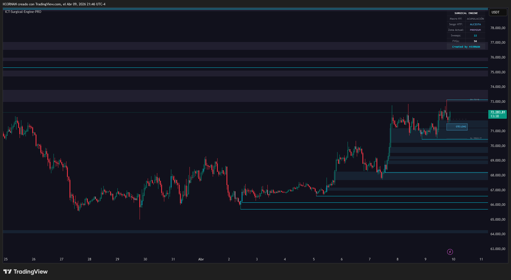
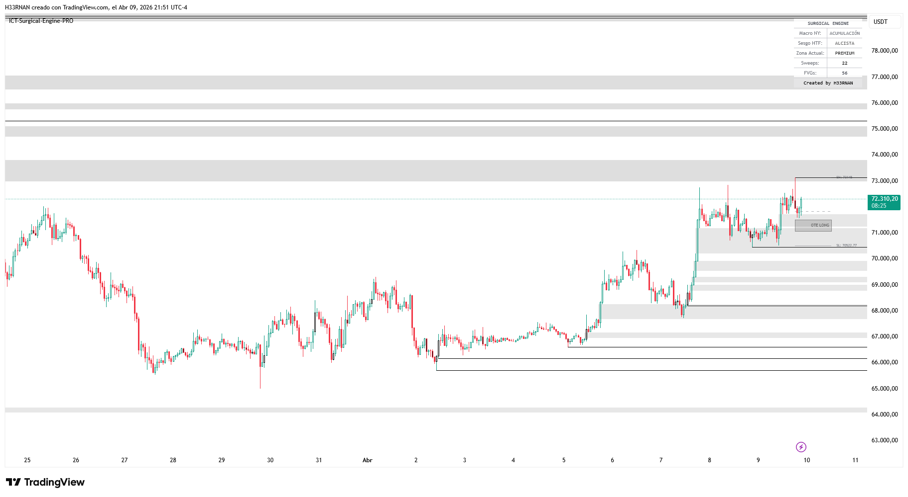

# 🎯 ICT Surgical Engine PRO
Created by H33RNAN

## 📸 Visual Engine (Artic & Mono UI)
*Designed for minimal visual fatigue and maximum institutional precision.*

---

## 🇬🇧 English Documentation

### 🛠 Technical Specifications
A surgical precision algorithm for TradingView (Pine Script v6) designed to eradicate visual noise and repainting. Built for institutional traders focused on true price action and liquidity.

### 🚀 Core Features
- **Zero-Repaint Engine:** Immutable structural confirmation using a strict 3-bar mathematical latency. No history rewriting.
- **Dynamic FVG Mitigation:** Bullish and bearish gaps vanish in real-time the exact millisecond price mitigates the void.
- **Surgical OTE Projections:** Optimal Trade Entry boxes (62%-79%) with automatic Swing High / Swing Low price labels on the right margin.
- **Institutional HUD:** Built-in dashboard tracking true NY Macros (Asia Accumulation, London Manipulation, NY Distribution) strictly anchored to EST, regardless of your local timezone. 

### ⚙️ How to Use
1. Copy the source code from `ICT_Surgical_Engine_PRO.pine`.
2. Open TradingView > Pine Editor > Paste the code.
3. Click **"Add to chart"**.
4. **Crucial:** Right-click the indicator colors on your chart > Visual Order > **Send to Back**.

### ⚖️ Disclaimer
*This script is for educational and theoretical purposes only. It is not financial advice. Trading involves significant risk.*

---

## 🇪🇸 Documentación en Español

### 🛠 Especificaciones Técnicas
Algoritmo de precisión quirúrgica para TradingView (Pine Script v6) diseñado para erradicar el ruido visual y el repintado. Construido para traders institucionales enfocados en acción del precio pura y liquidez.

### 🚀 Características Core
- **Motor Zero-Repintado:** Confirmación estructural inmutable usando una latencia estricta de 3 velas. Cero manipulación histórica.
- **Mitigación FVG Dinámica:** Los vacíos alcistas y bajistas desaparecen en tiempo real en el milisegundo exacto en que el precio los mitiga.
- **Proyecciones OTE Quirúrgicas:** Cajas de entrada óptima (62%-79%) con etiquetas automáticas de precio SH/SL en el margen derecho.
- **HUD Institucional:** Panel integrado que rastrea las verdaderas macros de NY (Acumulación, Manipulación, Distribución) ancladas estrictamente al horario EST, sin importar tu zona horaria local.

### ⚙️ Cómo usar
1. Copia el código fuente de `ICT_Surgical_Engine_PRO.pine`.
2. Abre TradingView > Pine Editor > Pega el código.
3. Haz clic en **"Añadir al gráfico"**.
4. **Crucial:** Clic derecho sobre los colores del indicador en tu gráfico > Orden visual > **Enviar al fondo**.

### ⚖️ Disclaimer
*Este script es estrictamente para fines educativos y teóricos. No es asesoramiento financiero. El trading conlleva un riesgo significativo.*
